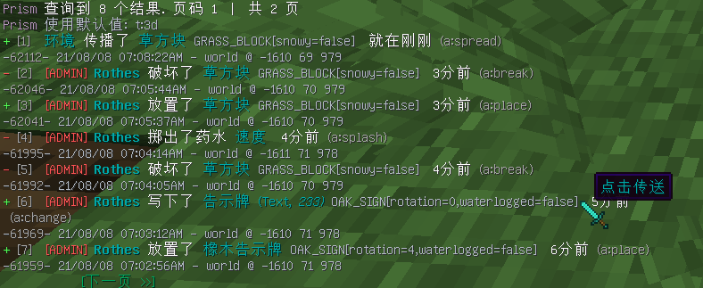

#####
标志
#####

.. tip::

  | ``/pr flags``
  | ``/pr 标志``

此指令会向执行者展示所有可用的标志. 这里面的一些指令标志可以控制将要运行的进程的特定细节, 让您获得 Prism 的全新控制能力.

排水/仅排水/仅排熔岩
^^^^^^^^^^^^^^^^^^^^^^^^^^^^
``/prism (指令) (参数) -drain``

添加了排水标志会在回滚期间执行一个排水操作 (与 `/prism drain` 的效果完全相同). 使用 ``-drain-lava`` 或者 ``-drain-water`` 可以针对一种特定的液体来执行排水操作.

扩展
^^^^^^^^

除非在配置文件中启用了显示扩展记录, 我们在默认情况下是不会向您显示扩展信息的, 可以减少杂乱的信息.
但是有的时候您可能会需要它.
使用 ``-extended`` 可以查询到扩展记录.

不分组
^^^^^^^^

不想获得自动分组后的查询信息?
这种情况可以使用 ``-no-group``.

不灭火
^^^^^^^^^^^^^

``/prism (指令) (参数) -no-ext``

如果在配置文件中配置了, Prism 会在执行 行为为burn 的回滚操作时自动扑灭范围内的火焰. 如果想要为一次特殊的回滚操作关闭此功能, 可以在指令中使用该标志.

覆写
^^^^^^^^^

``/prism (指令) (参数) -overwrite``

覆盖所有在操作过程中可能冲突的方块. 如果没有此标志, 默认它们会被跳过.

每页结果
^^^^^^^^

``/prism (指令) (参数) -per-page=#``

调整一次查询中每页显示的结果数量.

分享
^^^^^

``/prism (指令) (参数) -share=#``

分享当前查询的结果给列表中的在线玩家.

粘贴
^^^^^

``/prism (指令) (参数) -paste``

将结果粘贴在 "https://paste.gg" 中. 这是一个粘贴箱服务网站.